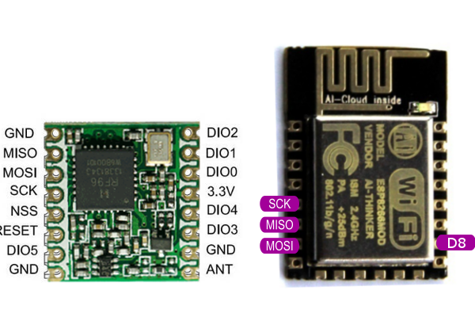

# HLC

HLC is (Hoeks.ma Location) is a method, based on LoRaWAN and a wifi microcontroller (esp8266). The microcontroller will scan for BSSID's from wifi ap's, and sends it to the gateway. Then the server will calculate the location, based on the BSSID's by Google api request.

I use The Thingsnetwork to connect my node

# hardware
- esp8266 / WemosD1 / Nodemcu / esp3212 / ..
- rfm95 (for europe)
- 3.3v power supply

# shields
@hallard made some shields you can use
- https://github.com/hallard/WeMos-Lora

# howto
***Arduino***
- Make sure you have a working ESP8266 / hoperfm node:
-     Install https://github.com/esp8266/Arduino
-     Install the lmic library: https://github.com/matthijskooijman/arduino-lmic/ (see installing)
- Open the test.ino file in Arduino 
- Edit your keys
- Flash to your esp

***Node.js***
- Install node.js on your local machine or on your server
- run "npm install wifi-location -g" in your terminal. Maybe you have to use sudo or cmd adm. in windows.
- copy the map node.js to your computer
- edit the vars in location.js: appEUI and accessKey
- in the terminal with the node.js files type: node location.js
- browse to localhost or your ip from the server to see your node :D.
